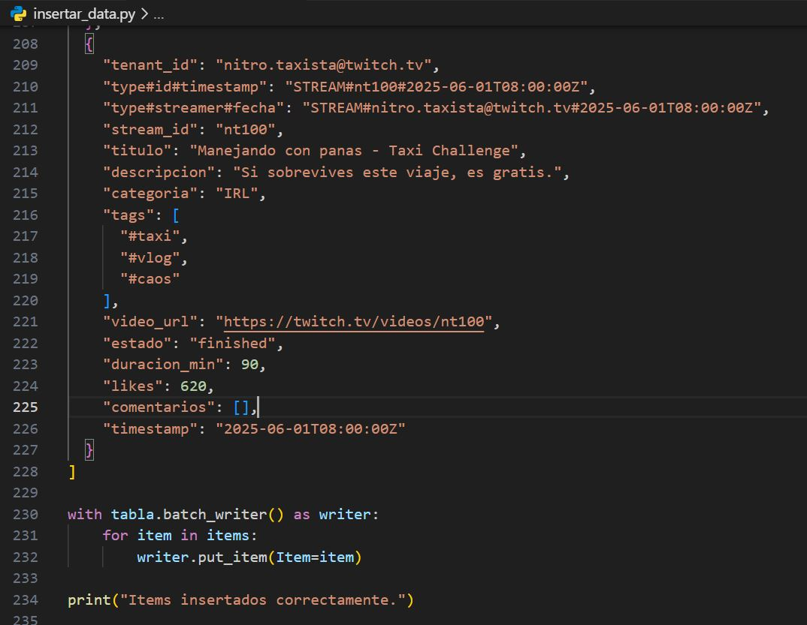
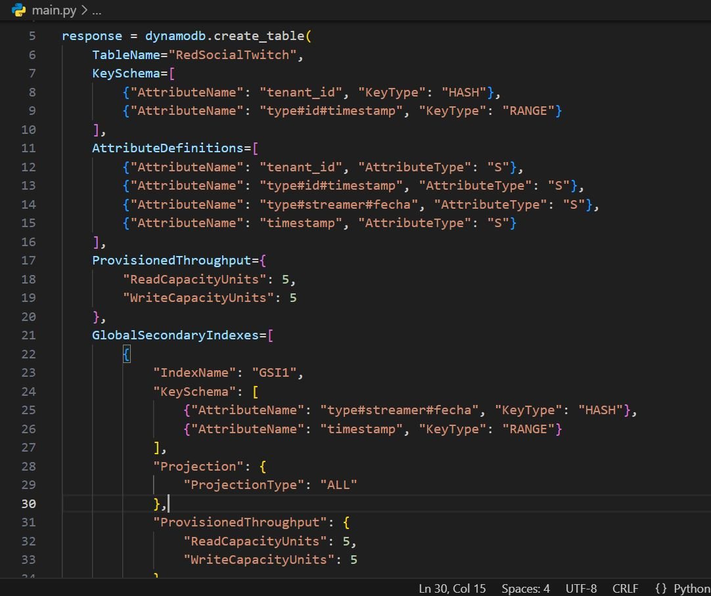
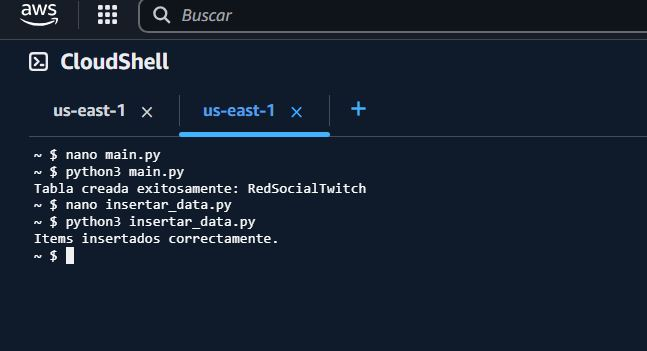
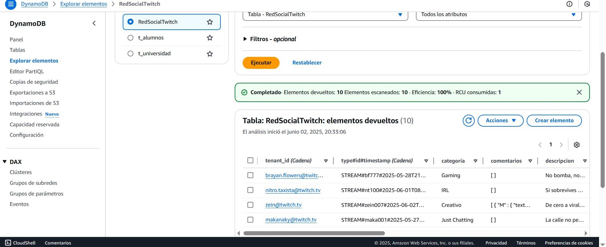
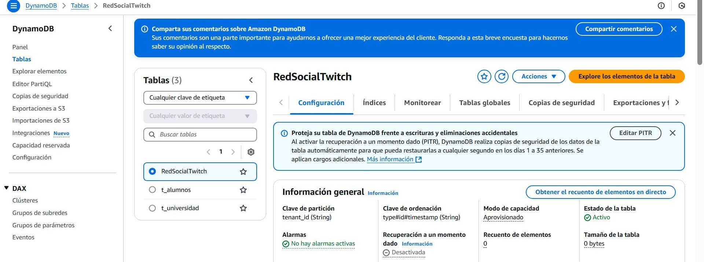
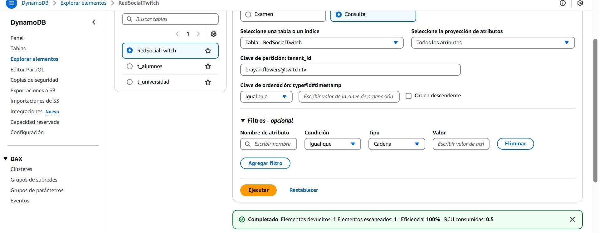
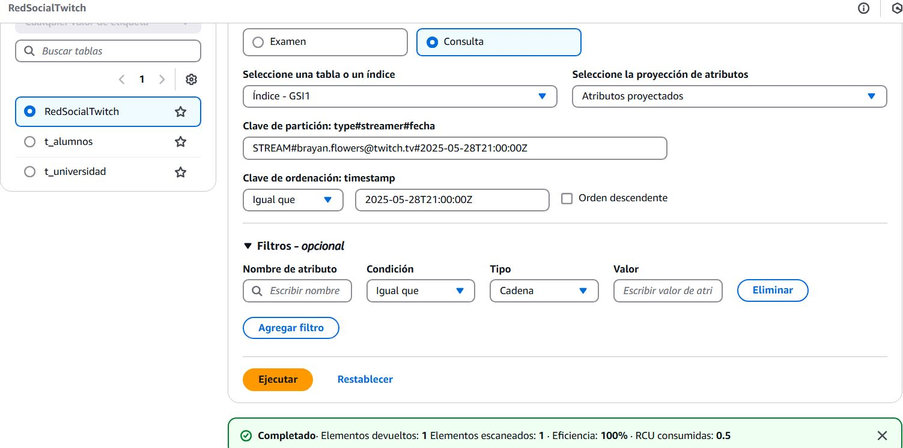
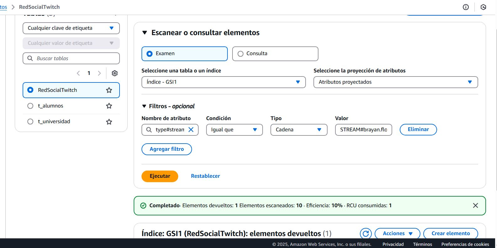

# Ejercicio 3 - Tabla Multitenancy en Dynamo DB - Twitch

## 1. Diseño de la Base de Datos en DynamoDB (Modelo Multitenancy)

Se ha diseñado una solución multitenancy basada en una sola tabla (Shared Database Schema) para representar una red social tipo Twitch, orientada a creadores de contenido y streamers.

Nombre de la tabla: RedSocialTwitch

#### Claves principales:
* **Partition Key (PK): tenant_id:** Identifica al streamer (por su correo).
* **Sort Key (SK): type#id#timestamp:** Estructura jerárquica que permite organizar por tipo (ejm: STREAM, CLIP), el ID del recurso y su fecha.

```
"tenant_id": "zein@twitch.tv",
"type#id#timestamp": "STREAM#zein007#2025-06-02T17:00:00Z"
```
**Índice Secundario (GSI):**

Se ha creado un índice adicional para permitir consultas por streamer y orden cronológico:

- **GSI1PK: type#streamer#fecha:** agrupa todos los streams de un mismo usuario.
- **GSI1SK: timestamp:** permite ordenar por fecha.

## 2. Estructura de los Items
Cada registro representa un stream individual. Ejemplo:

```
{
    "tenant_id": "brayan.flowers@twitch.tv",
    "type#id#timestamp": "STREAM#bf777#2025-05-28T21:00:00Z",
    "type#streamer#fecha": "STREAM#brayan.flowers@twitch.tv#2025-05-28T21:00:00Z",
    "stream_id": "bf777",
    "titulo": "Regalando flores explosivas",
    "descripcion": "No bomba, no party and flowers.",
    "categoria": "Gaming",
    "tags": [
      "#valorant",
      "#fps",
      "#clutch"
    ],
    "video_url": "https://twitch.tv/videos/bf777",
    "estado": "finished",
    "duracion_min": 110,
    "likes": 492,
    "comentarios": [],
    "timestamp": "2025-05-28T21:00:00Z"
}  
```

## 3. Carga de Datos
Se preparó un script en Python con boto3 para cargar automáticamente 10 registros de distintos streamers:



## 4. Creación de la Tabla
El siguiente script define la tabla en DynamoDB junto con su GSI:



Para hacer los cambios en el servidor AWS lo hicimos en su consola con estos comandos:



Luego se crea la tabla y se insertan los datos en la plataforma:





## 5. Consultas posibles (queries)
a) Obtener la info de un solo usuario:



b) Obtener todos los streams de un streamer entre fechas (usando GSI)

* Consulta:


* Examen:


Se puede ver que Consulta resulta más eficiente que Examen.

## 6. Conclusión
El diseño propuesto permite una organización eficiente y escalable de una red social de video en vivo al estilo Twitch. El uso de claves compuestas y GSI’s permite:

- Filtrar y ordenar streams eficientemente.
- Consultas multitenancy limpias y extensibles.
- Adaptabilidad a nuevos tipos de contenido (ej. VOD, Clips, Shorts, etc.)
- Este modelo es fácilmente ampliable a métricas, seguidores, suscripciones, e incluso contenido privado o premium.

